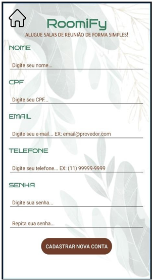

# Roomify - Aplicativo de Reservas de Salas de Reunião

## Visão Geral do Projeto

O Roomify é um aplicativo mobile desenvolvido em **Kotlin** e **Android Studio** com o objetivo de otimizar o processo de reserva e gerenciamento de salas de reunião em ambientes corporativos. Ele busca resolver problemas comuns como a falta de clareza sobre a disponibilidade das salas e a dificuldade em gerenciar horários, proporcionando uma plataforma centralizada para agendamentos eficientes.

<p align="center">
  
  <br>
  <em>Tela de Login do aplicativo.</em>
</p>

## Funcionalidades Principais

O sistema oferece uma série de funcionalidades para facilitar a gestão de salas:

* **Visualização de Disponibilidade:** Calendário interativo para visualizar a disponibilidade das salas em tempo real.

<p align="center">
  
  <br>
  <em>Tela de Calendário para visualização de datas disponíveis.</em>
</p>

* **Gestão de Reservas:**
    * Realização de novas reservas com confirmação automática por e-mail.

<p align="center">
  
  <br>
  <em>Tela de confirmação de agendamento.</em>
</p>

  * Alteração de reservas existentes (para administradores).

<p align="center">
  
  <br>
  <em>Tela de gerenciamento de salas (Administrador).</em>
</p>

  * Cancelamento de reservas, com atualização imediata da disponibilidade da sala.

* **Autenticação e Perfis de Acesso:** Sistema de login seguro com diferentes níveis de acesso para Usuários Comuns e Administradores.

<p align="center">
  
  <br>
  <em>Tela de Cadastro de novas contas.</em>
</p>

* **Recuperação de Senha:** Funcionalidade para recuperação de senha via e-mail.

<p align="center">
  
  <br>
  <em>Tela de Recuperação de Senha.</em>
</p>

* **Relatórios Detalhados:** Geração e exportação de relatórios de uso das salas (filtrados por tipo de sala e exportáveis em PDF).

<p align="center">
  
  <br>
  <em>Tela de Geração de Relatórios.</em>
</p>

<p align="center">
  
  <br>
  <em>Visão geral da tela principal do administrador.</em>
</p>

* **Gerenciamento Administrativo:**
    * Atualização de valores de aluguel das salas (para administradores).

<p align="center">
  
  <br>
  <em>Tela para alterar o valor do aluguel de salas.</em>
</p>

  * Exclusão de reservas (para administradores).

* **Notificações:** Envio de e-mails sobre quaisquer mudanças ou reservas realizadas.

## Tecnologias Utilizadas

* **Linguagem de Programação:** Kotlin
* **Ambiente de Desenvolvimento:** Android Studio
* **Banco de Dados:** Firebase
* **Gerenciamento de Dependências:** Gradle
* **Design:** Material Design (padrão em apps Android modernos)

## Requisitos do Sistema

Para executar e desenvolver o Roomify, você precisará de:

* **Android Studio:** Versão mais recente recomendada.
* **SDK do Android:** Versão compatível com o projeto (verifique o `build.gradle` do módulo `app`).
* **JDK (Java Development Kit):** Versão compatível com o Android Studio.
* **Conexão com a Internet:** Necessária para o Gradle baixar dependências e para a comunicação com o Firebase.
* **Conta Firebase:** Configuração de um projeto Firebase para o banco de dados.

## Como Executar o Projeto

1.  **Clone o Repositório:**
    ```bash
    https://github.com/gustavovolpi/Roomify-Kotlin.git
    ```
2.  **Configuração do Firebase:**
    * Crie um novo projeto no [Firebase Console](https://console.firebase.google.com/).
    * Adicione um aplicativo Android ao seu projeto Firebase.
    * Siga as instruções do Firebase para baixar o arquivo `google-services.json` e coloque-o na pasta `app/` do seu projeto Android.
    * Configure as regras de segurança do seu banco de dados (Firestore ou Realtime Database, dependendo de qual você usou) no Firebase Console.
3.  **Abra no Android Studio:**
    * Abra o Android Studio.
    * Selecione "Open an existing Android Studio project" e navegue até a pasta raiz do projeto clonado (`Roomify-Kotlin`).
4.  **Sincronize o Gradle:**
    * Aguarde o Android Studio sincronizar o projeto com o Gradle. Se houver algum problema, verifique sua conexão com a internet e as dependências no `build.gradle`.
5.  **Execute o Aplicativo:**
    * Conecte um dispositivo Android (com depuração USB ativada) ou inicie um emulador.
    * Clique no botão "Run" (ícone de play verde) no Android Studio para instalar e executar o aplicativo.

## Estrutura do Projeto

A estrutura segue o padrão de projetos Android:

* `.gradle/`: Arquivos de configuração do Gradle.
* `.idea/`: Arquivos de configuração do Android Studio.
* `app/`: Contém o código-source do aplicativo, recursos, manifest, etc.
* `gradle/`: Wrappers do Gradle.
* `.gitignore`: Define quais arquivos e pastas o Git deve ignorar (já configurado para Android).
* `build.gradle.kts`: Arquivos de script Gradle para o projeto e módulos.
* `local.properties`: Propriedades locais do SDK (ignoradas pelo Git).
* `settings.gradle.kts`: Configurações de módulos do Gradle.
* `README.md`: Este arquivo de documentação.
* `LICENSE`: O arquivo de licença do projeto.
* `screenshot/`: Pasta para armazenar as imagens das telas do aplicativo.

## Mais Telas do Roomify

Para uma visão mais detalhada da interface do usuário e outras funcionalidades:

<p align="center">
  
  <br>
  <em>Página de perfil do usuário.</em>
</p>


---

## Contribuição

Contribuições são bem-vindas! Sinta-se à vontade para abrir issues para bugs ou sugestões de novas funcionalidades, ou enviar pull requests.

## Autores

* GUSTAVO VOLPI

## Licença

Este projeto está licenciado sob a [MIT License](LICENSE).
